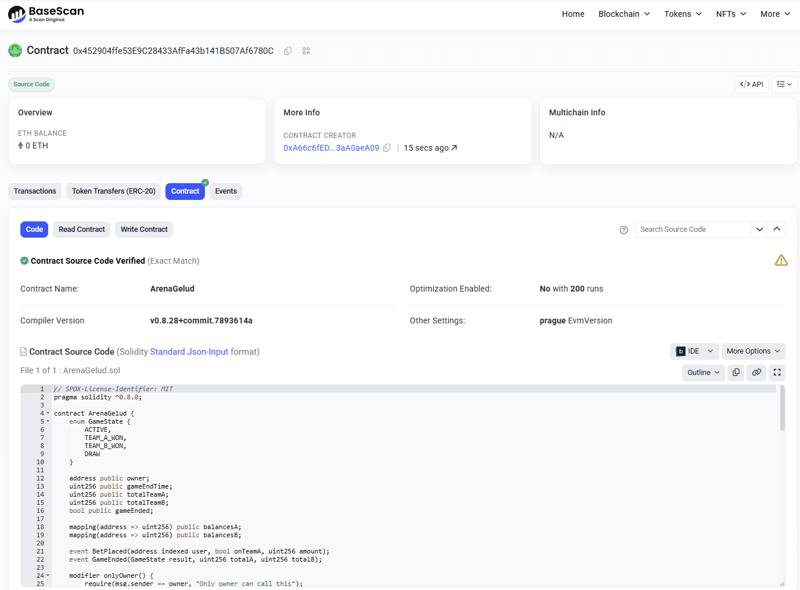

# ArenaGelud Betting Game (Formerly Tug of War)

A decentralized betting game where users bet ETH on Team A or Team B. The team with the highest total bets wins the entire pot, distributed proportionally to the winners.

## Project Structure

- `src/ArenaGelud.sol`: Smart contract implementation.
- `test/ArenaGelud.t.sol`: Comprehensive test suite.
- `script/Deploy.s.sol`: Deployment script.

## Getting Started

### Prerequisites

- **Foundry**: Ensure you have Foundry installed.
  ```bash
  curl -L https://foundry.paradigm.xyz | bash
  foundryup
  ```


### Configuration

Create a `.env` file in the root directory:
```bash
cp .env.example .env
```
Ensure it contains your `PRIVATE_KEY` and `RPC_URL`.


### Running Tests

Run the test suite to verify contract logic:
```bash
forge test -vvvv
```
or we have some log with test
```bash
forge test -vv
```

### Deployment

To deploy to Base Sepolia (or any EVM network):

1. Set up your environment variables (optional, or pass directly):
   - `RPC_URL`: Your Base Sepolia RPC URL.
   - `PRIVATE_KEY`: Your deployment wallet private key.
   - `BASESCAN_API_KEY`: For contract verification.

2. Run the deployment command:
   ```bash
   forge script script/Deploy.s.sol:DeployScript --rpc-url <RPC_URL> --private-key <PRIVATE_KEY> --broadcast --verify --etherscan-api-key <BASESCAN_API_KEY>
   ```

## Reward Logic

The game uses a **Proportional Reward System** (Pull Payment):

1.  **Winner Determination**:
    - If `TotalA > TotalB` -> Team A Wins.
    - If `TotalB > TotalA` -> Team B Wins.
    - If `TotalA == TotalB` -> Draw.

2.  **Reward Formula**:
    - **Winning Team**: Users who bet on the winning team receive a share of the *total pot* (A + B) based on their contribution to the winning side.
      $$ \text{Reward} = \frac{\text{UserBet} \times (\text{TotalA} + \text{TotalB})}{\text{TotalWinningTeam}} $$
      *Note: Multiplication is performed before division to maintain precision.*
    
    - **Draw**: Users can claim a full refund of their bet.
    - **Losing Team**: Users who bet on the losing team receive nothing.

## Broadcast link for deploying and verification

https://sepolia.basescan.org/address/0x452904ffe53e9c28433affa43b141b507af6780c


== Logs ==
  ArenaGelud deployed at: 0x452904ffe53E9C28433AfFa43b141B507Af6780C

## Setting up 1 EVM.

==========================

Chain 84532

Estimated gas price: 0.0014 gwei

Estimated total gas used for script: 1443790

Estimated amount required: 0.000002021306 ETH

==========================

##### base-sepolia
✅  [Success] Hash: 0x42214f3ea1860ccaed9767e3b431543eef2ce7ffed8b831b76ebd75b827a5513
Contract Address: 0x452904ffe53E9C28433AfFa43b141B507Af6780C
Block: 36339408
Paid: 0.0000013327296 ETH (1110608 gas * 0.0012 gwei)

✅ Sequence #1 on base-sepolia | Total Paid: 0.0000013327296 ETH (1110608 gas * avg 0.0012 gwei)


==========================



ONCHAIN EXECUTION COMPLETE & SUCCESSFUL.
##
## 🚀 Deployment Information

Smart Contract **ArenaGelud** telah berhasil dideploy dan diverifikasi di jaringan Base Sepolia.

| Item | Detail |
| :--- | :--- |
| **Contract Name** | `ArenaGelud` |
| **Network** | Base Sepolia Testnet |
| **Contract Address** | [`0x452904ffe53E9C28433AfFa43b141B507Af6780C`](https://sepolia.basescan.org/address/0x452904ffe53e9c28433affa43b141b507af6780c) |
| **Status** | ✅ Verified |
| **Compiler** | v0.8.28 |
| **Explorer Link** | [View on Basescan](https://sepolia.basescan.org/address/0x452904ffe53e9c28433affa43b141b507af6780c#code) |

---# SmartContractBCC
